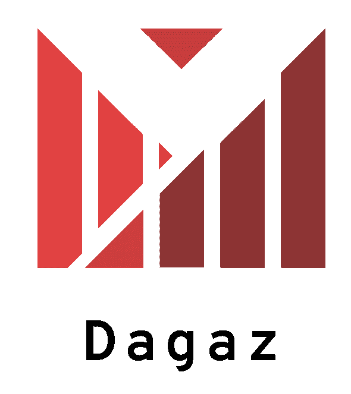

# Dagaz

<!--

-->


[](https://github.com/stepney141/dagaz-new/actions/workflows/coverage-commit.yml)

The next version of [Dagaz Project](https://github.com/GlukKazan/Dagaz), a general boardgame creating/playing engine using Javascript.

This is just an alpha version and still a work in progeress. We always welcome any suggestions or contributions that improve the quality of our projects!

## Setting up the dev environment

```bash
$ git clone https://github.com/stepney141/dagaz-new
$ cd dagaz-new
$ npm install
```

## Testing

### Unit tests

Unit tests with [Jest](https://jestjs.io/) test suite are available.

```bash
$ npm run test
```

### Perft

```bash
$ npm run exec benchmark/perft/chess.perft.ts
$ npm run exec benchmark/perft/english-checkers.perft.ts
$ npm run exec benchmark/perft/international-checkers.perft.ts
$ npm run exec benchmark/perft/russian-checkers.perft.ts
```
